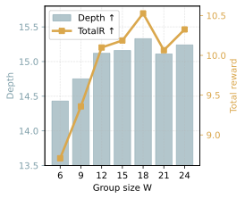
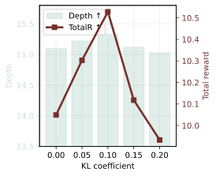
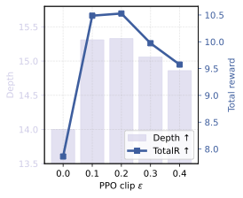
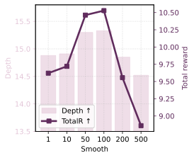

# HRPO for SID-Based Generative Recommendation in KuaiSim

This repository includes the end-to-end pipeline to reproduce HRPO and the main baselines used in our experiments.

The workflow is:
1. Train the simulator environment model (URM).
2. Build SID mappings.
3. Train base recommendation models.
4. Train HRPO (table build + RRPO).
5. Evaluate HRPO and all baselines in KuaiSim.

## 1. Environment Setup

```bash
conda create -n kuaisim python=3.10 -y
conda activate kuaisim

# Pick a torch build that matches your CUDA/CPU setup.
pip install torch torchvision

# Core dependencies.
pip install numpy pandas scikit-learn tqdm matplotlib

# Needed by TIGER scripts.
pip install transformers sentencepiece
```

Optional (avoids Matplotlib cache warnings on some systems):

```bash
export MPLCONFIGDIR=/tmp/matplotlib
```

## 2. Data And Path Setup

Run all commands from repository root:

```bash
export PROJECT_ROOT="$PWD"
export DATA_ROOT="$PROJECT_ROOT/dataset/kuairand/kuairand-Pure/data"

# Use your actual dataset filenames here.
export LOG_CSV="$DATA_ROOT/log_standard_4_22_to_5_08_pure.csv"
export USER_FEAT="$DATA_ROOT/user_features_Pure_fillna.csv"
export VIDEO_BASIC="$DATA_ROOT/video_features_basic_Pure_fillna.csv"
export VIDEO_STAT="$DATA_ROOT/video_features_statistic_pure.csv"
```

Many training scripts expect the legacy filename `log_session_4_08_to_5_08_Pure.csv`.
If your log file uses a different name, create a compatibility symlink once:

```bash
ln -sf "$LOG_CSV" "$DATA_ROOT/log_session_4_08_to_5_08_Pure.csv"
```

## 3. Step-By-Step Reproduction For HRPO

### Step 3.1 Train the simulator URM (required for all env-based evaluation)

```bash
mkdir -p "$PROJECT_ROOT/code/output/Kuairand_Pure/env/log"

python3 "$PROJECT_ROOT/code/train_multibehavior.py" \
  --epoch 10 \
  --seed 619607 \
  --lr 0.0001 \
  --batch_size 128 \
  --val_batch_size 128 \
  --cuda 0 \
  --reader KRMBSeqReader \
  --train_file "$DATA_ROOT/log_session_4_08_to_5_08_Pure.csv" \
  --user_meta_file "$USER_FEAT" \
  --item_meta_file "$VIDEO_BASIC" \
  --max_hist_seq_len 100 \
  --data_separator ',' \
  --meta_file_separator ',' \
  --n_worker 4 \
  --val_holdout_per_user 5 \
  --test_holdout_per_user 5 \
  --model KRMBUserResponse \
  --loss bce \
  --l2_coef 0.0 \
  --model_path "$PROJECT_ROOT/code/output/Kuairand_Pure/env/user_KRMBUserResponse_lr0.0001_reg0_nlayer2.model" \
  --user_latent_dim 32 \
  --item_latent_dim 32 \
  --enc_dim 64 \
  --n_ensemble 2 \
  --attn_n_head 4 \
  --transformer_d_forward 64 \
  --transformer_n_layer 2 \
  --state_hidden_dims 128 \
  --scorer_hidden_dims 128 32 \
  --dropout_rate 0.1 \
  > "$PROJECT_ROOT/code/output/Kuairand_Pure/env/log/user_KRMBUserResponse_lr0.0001_reg0_nlayer2.model.log"
```

### Step 3.2 Build SID mapping (4 layers, vocab size 32)

```bash
mkdir -p "$PROJECT_ROOT/code/dataset/kuairand/kuairand-Pure/sid/32_mask"

python3 "$PROJECT_ROOT/code/build_pure_sid.py" \
  --video-basic "$VIDEO_BASIC" \
  --video-stat "$VIDEO_STAT" \
  --output-dir "$PROJECT_ROOT/code/dataset/kuairand/kuairand-Pure/sid/32_mask" \
  --n-layers 4 \
  --codebook-size 32 \
  --max-tag 500
```

### Step 3.3 Train OneRec base model (SFT init)

```bash
bash "$PROJECT_ROOT/code/train_onerec_value.sh"
```

Default checkpoint:

```bash
export INIT_CKPT="$PROJECT_ROOT/code/checkpoints/checkpoints/onerec_value_v2_32_mask_mini/epoch_5.pt"
```

### Step 3.4 Build HRPO tables

```bash
bash "$PROJECT_ROOT/code/build_hrpo_table.sh"
```

This writes behavior tables under:
`code/dataset/kuairand/kuairand-Pure/hrpo_bucket/`

### Step 3.5 Train HRPO (RRPO)

```bash
bash "$PROJECT_ROOT/code/train_hrpo_rrpo_ntp.sh"
```

Default HRPO checkpoint:

```bash
export HRPO_CKPT="$PROJECT_ROOT/code/checkpoints/checkpoints/onerec_value_v2_32_mask_mini/hrpo_rrpo_ntp/epoch_1.pt"
```

### Step 3.6 Evaluate HRPO in KuaiSim

```bash
ONEREC_CKPT="$HRPO_CKPT" bash "$PROJECT_ROOT/code/eval_onerec_value_rerank.sh"
```

## 4. Reproduce Baselines (Train + Eval)

## 4.1 RL baselines (A2C / DDPG / TD3 / HAC)

These scripts use relative paths, so run them from `code/`:

```bash
cd "$PROJECT_ROOT/code"
```

### A2C

Train:

```bash
bash train_A2C_krpure_wholesession.sh
```

Evaluate:

```bash
bash eval_actor_critic.sh
```

### DDPG (whole-session)

Train:

```bash
bash train_ddpg_krpure_wholesession.sh
```

Evaluate:

```bash
python3 eval_actor_critic.py \
  --env_class KREnvironment_WholeSession_GPU \
  --policy_class OneStageHyperPolicy_with_DotScore \
  --critic_class QCritic \
  --buffer_class HyperActorBuffer \
  --agent_class DDPG \
  --uirm_log_path output/Kuairand_Pure/env/log/user_KRMBUserResponse_lr0.0001_reg0_nlayer2.model.log \
  --slate_size 1 \
  --episode_batch_size 32 \
  --item_correlation 0.2 \
  --max_step_per_episode 20 \
  --eval_episodes 1000 \
  --log_every 20 \
  --initial_temper 20 \
  --seed 11 \
  --single_response \
  --save_path output/Kuairand_Pure/agents/DDPG_OneStageHyperPolicy_with_DotScore_actor0.0001_critic0.001_niter20000_reg0.00001_ep0.01_noise0.1_bs128_epbs32_step20_seed11_slatesize1/model \
  --policy_action_hidden 256 64 \
  --policy_noise_var 0.1 \
  --policy_noise_clip 1.0 \
  --state_user_latent_dim 16 \
  --state_item_latent_dim 16 \
  --state_transformer_enc_dim 32 \
  --state_transformer_n_head 4 \
  --state_transformer_d_forward 64 \
  --state_transformer_n_layer 3 \
  --state_dropout_rate 0.1 \
  --critic_hidden_dims 256 64 \
  --critic_dropout_rate 0.1
```

### TD3 (whole-session)

Train:

```bash
bash train_TD3_krpure_wholesession.sh
```

Evaluate:

```bash
python3 eval_actor_critic.py \
  --env_class KREnvironment_WholeSession_GPU \
  --policy_class OneStageHyperPolicy_with_DotScore \
  --critic_class QCritic \
  --buffer_class HyperActorBuffer \
  --agent_class TD3 \
  --uirm_log_path output/Kuairand_Pure/env/log/user_KRMBUserResponse_lr0.0001_reg0_nlayer2.model.log \
  --slate_size 1 \
  --episode_batch_size 32 \
  --item_correlation 0.2 \
  --max_step_per_episode 20 \
  --eval_episodes 1000 \
  --log_every 20 \
  --initial_temper 20 \
  --seed 2026 \
  --single_response \
  --save_path output/Kuairand_Pure/agents/TD3_OneStageHyperPolicy_with_DotScore_actor0.00001_critic0.001_niter20000_reg0.00001_ep0.01_noise0.1_bs128_epbs32_step20_seed2026_slatesize1/model \
  --policy_action_hidden 256 64 \
  --policy_noise_var 0.1 \
  --policy_noise_clip 1.0 \
  --state_user_latent_dim 16 \
  --state_item_latent_dim 16 \
  --state_transformer_enc_dim 32 \
  --state_transformer_n_head 4 \
  --state_transformer_d_forward 64 \
  --state_transformer_n_layer 3 \
  --state_dropout_rate 0.1 \
  --critic_hidden_dims 256 64 \
  --critic_dropout_rate 0.1
```

### HAC (whole-session)

Train:

```bash
bash train_HAC_krpure_wholesession.sh
```

Evaluate:

```bash
python3 eval_actor_critic.py \
  --env_class KREnvironment_WholeSession_GPU \
  --policy_class OneStageHyperPolicy_with_DotScore \
  --critic_class QCritic \
  --buffer_class HyperActorBuffer \
  --agent_class HAC \
  --uirm_log_path output/Kuairand_Pure/env/log/user_KRMBUserResponse_lr0.0001_reg0.01_nlayer2.model.log \
  --slate_size 6 \
  --episode_batch_size 32 \
  --item_correlation 0.2 \
  --max_step_per_episode 20 \
  --eval_episodes 1000 \
  --log_every 20 \
  --initial_temper 20 \
  --seed 11 \
  --single_response \
  --save_path output/Kuairand_Pure/agents/HAC_OneStageHyperPolicy_with_DotScore_actor0.00001_critic0.001_niter20000_reg0.00001_ep0.01_noise0.1_bs128_epbs32_step20_seed11/model \
  --policy_action_hidden 256 64 \
  --policy_noise_var 0.1 \
  --policy_noise_clip 1.0 \
  --state_user_latent_dim 16 \
  --state_item_latent_dim 16 \
  --state_transformer_enc_dim 32 \
  --state_transformer_n_head 4 \
  --state_transformer_d_forward 64 \
  --state_transformer_n_layer 3 \
  --state_dropout_rate 0.1 \
  --critic_hidden_dims 256 64 \
  --critic_dropout_rate 0.1
```

Note: `train_HAC_krpure_wholesession.sh` uses URM log name `...reg0.01...`. If you only trained `...reg0...`, either retrain URM with `--l2_coef 0.01` or update `log_name` in that script.

Then return to repo root:

```bash
cd "$PROJECT_ROOT"
```

## 4.2 Decision Transformer baseline

Train offline DT on logged sessions:

```bash
bash "$PROJECT_ROOT/code/train_dt_log_session.sh"
```

Fine-tune DT in simulator:

```bash
bash "$PROJECT_ROOT/code/train_dt_env_click.sh"
```

Evaluate:

```bash
bash "$PROJECT_ROOT/code/eval_dt_policy_env.sh"
```

## 4.3 Sequence baselines (GRU4Rec / SASRec / TIGER)

### GRU4Rec

```bash
bash "$PROJECT_ROOT/code/train_gru4rec_baseline.sh"
bash "$PROJECT_ROOT/code/eval_gru4rec_env.sh"
```

### SASRec

```bash
bash "$PROJECT_ROOT/code/train_sasrec_baseline.sh"
bash "$PROJECT_ROOT/code/eval_sasrec_env.sh"
```

### TIGER

```bash
bash "$PROJECT_ROOT/code/train_TIGER_krpure.sh"
bash "$PROJECT_ROOT/code/eval_tiger_env.sh"
```

## 4.4 OneRec-family baselines (SFT / S-DPO / SPRec / ReRE-GRPO)

### OneRec SFT

```bash
bash "$PROJECT_ROOT/code/train_onerec_value.sh"
ONEREC_CKPT="$PROJECT_ROOT/code/checkpoints/checkpoints/onerec_value_v2_32_mask_mini/epoch_5.pt" \
  bash "$PROJECT_ROOT/code/eval_onerec_value_rerank.sh"
```

### S-DPO

```bash
bash "$PROJECT_ROOT/code/train_s_dpo.sh"
ONEREC_CKPT="$PROJECT_ROOT/code/checkpoints/checkpoints/onerec_value_v2_32_mask_mini/s_dpo/best.pt" \
  bash "$PROJECT_ROOT/code/eval_onerec_value_rerank.sh"
```

### SPRec

```bash
bash "$PROJECT_ROOT/code/train_sprec.sh"
ONEREC_CKPT="$PROJECT_ROOT/code/checkpoints/checkpoints/onerec_value_v2_32_mask_mini/sprec/best.pt" \
  bash "$PROJECT_ROOT/code/eval_onerec_value_rerank.sh"
```

### ReRE-GRPO

```bash
bash "$PROJECT_ROOT/code/train_rere_grpo.sh"
ONEREC_CKPT="$PROJECT_ROOT/code/checkpoints/checkpoints/onerec_value_v2_32_mask_mini/rere_grpo_grpo/best.pt" \
  bash "$PROJECT_ROOT/code/eval_onerec_value_rerank.sh"
```

## 5. Where To Read Results

- Most evaluation scripts print metrics directly to stdout.
- You can save logs with `tee`, for example:

```bash
mkdir -p "$PROJECT_ROOT/results"
ONEREC_CKPT="$HRPO_CKPT" bash "$PROJECT_ROOT/code/eval_onerec_value_rerank.sh" | tee "$PROJECT_ROOT/results/hrpo_eval.log"
```

Useful output folders:
- `code/output/Kuairand_Pure/` for environment and RL logs.
- `code/checkpoints/checkpoints/` for model checkpoints.
- `output/KuaiRand_Pure/` for DT/TIGER outputs in some scripts.

## 6. Quick Sanity Checks

Check core files before running long jobs:

```bash
for f in \
  "$DATA_ROOT/log_session_4_08_to_5_08_Pure.csv" \
  "$DATA_ROOT/user_features_Pure_fillna.csv" \
  "$VIDEO_BASIC" \
  "$VIDEO_STAT"; do
  if [ -f "$f" ]; then
    echo "[OK] $f"
  else
    echo "[MISSING] $f"
  fi
done
```

If an eval script says checkpoint/log is missing, first confirm the corresponding train script completed and the expected output path exists.

## 7. Baseline Results (From Paper)

The following results are transcribed from the experiment tables in the paper source (`5Experiments.tex`) and can be used as reference targets when reproducing runs in this repository.

### 7.1 Offline Training + Session-Level Evaluation

| Method | Depth | Avg. reward | Total reward | Coverage | Click | Long | Like | Comment | Forward | Follow | Hate |
|---|---:|---:|---:|---:|---:|---:|---:|---:|---:|---:|---:|
| Random | 11.16 | 0.1898 | 2.1170 | 100% | 18.97% | 12.32% | 4.42% | 1.33% | 0.25% | 0.30% | 0.00% |
| DT | 12.79 | 0.4274 | 5.4660 | 91% | 42.74% | 37.19% | 5.42% | 2.05% | 0.50% | 0.40% | 0.01% |
| GRU4Rec | 11.52 | 0.2573 | 2.9650 | 84% | 25.73% | 21.79% | 3.32% | 1.27% | 0.34% | 0.39% | &lt;0.01% |
| SASRec | 12.09 | 0.3351 | 4.0530 | 72% | 33.51% | 26.75% | 5.35% | 1.81% | 0.43% | 0.53% | 0.03% |
| TIGER | 13.85 | 0.5442 | 7.5370 | 70% | 54.42% | 46.78% | 5.94% | 2.41% | 0.39% | 0.24% | 0.02% |
| SFT | 14.02 | 0.5642 | 7.9110 | 60% | 56.41% | 49.80% | 5.97% | 2.35% | 0.54% | 0.28% | 0.01% |
| DPO | 13.99 | 0.5610 | 7.8490 | 58% | 56.10% | 49.49% | 7.09% | 2.67% | 0.59% | 0.45% | 0.05% |
| S-DPO | 13.64 | 0.5240 | 7.1470 | 60% | 52.39% | 45.52% | 7.82% | 2.65% | 0.73% | 0.48% | &lt;0.01% |
| SPRec | 14.14 | 0.5753 | 8.1370 | 57% | 57.52% | 51.29% | 6.93% | 2.76% | 0.89% | 0.57% | 0.06% |
| GRPO | 14.07 | 0.5690 | 8.0060 | 58% | 56.90% | 50.49% | 7.54% | 2.85% | 0.69% | 0.47% | 0.02% |
| HRPO | 15.33 | 0.6869 | 10.5280 | 56% | 68.69% | 63.04% | 5.23% | 2.28% | 0.57% | 0.25% | 0.03% |

### 7.2 Offline Training + One-Step Evaluation (Depth = 1)

| Method | Depth | Avg. reward | Total reward | Coverage | Click | Long | Like | Comment | Forward | Follow | Hate |
|---|---:|---:|---:|---:|---:|---:|---:|---:|---:|---:|---:|
| Random | 1.0 | 0.2130 | 0.2130 | 100% | 21.30% | 13.00% | 2.90% | 1.20% | 0.40% | 0.30% | 0.00% |
| SFT | 1.0 | 0.4510 | 0.4510 | 28% | 45.10% | 34.20% | 3.10% | 0.70% | 0.40% | 0.30% | 0.00% |
| S-DPO | 1.0 | 0.4600 | 0.4600 | 23% | 46.00% | 36.80% | 3.40% | 0.70% | 0.40% | 0.30% | 0.00% |
| SPRec | 1.0 | 0.4570 | 0.4570 | 21% | 45.70% | 35.30% | 3.70% | 0.80% | 0.40% | 0.30% | 0.00% |
| GRPO | 1.0 | 0.4620 | 0.4620 | 23% | 46.20% | 36.90% | 3.60% | 0.80% | 0.50% | 0.30% | 0.00% |
| HRPO | 1.0 | 0.5480 | 0.5480 | 15% | 54.80% | 44.70% | 3.10% | 0.60% | 0.30% | 0.30% | 0.00% |

### 7.3 Simulator-Interactive Training + Session-Level Evaluation

| Method | Depth | Avg. reward | Total reward | Coverage | Click | Long | Like | Comment | Forward | Follow | Hate |
|---|---:|---:|---:|---:|---:|---:|---:|---:|---:|---:|---:|
| Random | 11.16 | 0.1898 | 2.1170 | 100% | 18.97% | 12.32% | 4.42% | 1.33% | 0.25% | 0.30% | 0.00% |
| TD3 | 13.52 | 0.5128 | 6.9330 | 10% | 51.27% | 45.41% | 3.35% | 0.94% | 0.19% | 0.19% | 0.02% |
| A2C | 12.19 | 0.3468 | 4.2270 | 50% | 34.68% | 27.60% | 5.25% | 1.14% | 0.31% | 0.20% | 0.02% |
| DDPG | 13.71 | 0.5359 | 7.3470 | 3% | 53.59% | 48.98% | 4.97% | 1.54% | 0.48% | 0.21% | 0.01% |
| HAC | 13.97 | 0.5604 | 7.8270 | 3% | 56.04% | 50.84% | 5.13% | 2.24% | 0.50% | 0.42% | 0.04% |
| DT | 13.98 | 0.5624 | 7.8630 | 12% | 56.24% | 50.17% | 6.54% | 1.80% | 0.43% | 0.26% | &lt;0.01% |
| HRPO | 15.50 | 0.6931 | 10.7460 | 57% | 69.31% | 63.79% | 5.72% | 2.31% | 0.55% | 0.27% | 0.03% |

### 7.4 Sensitivity / Training Figures

| Group Size (W) | KL Coefficient | PPO Clip | Smoothing Alpha |
|---|---|---|---|
|  |  |  |  |
